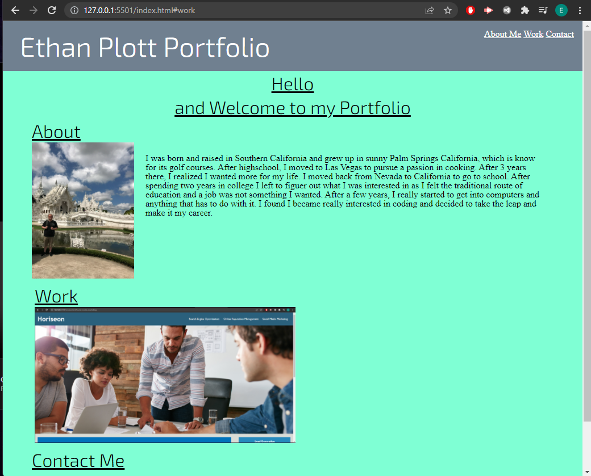

# portfolio

I created this Portfolio to keep track of my work and progress in coding. I will be updating this very often as I gain experience and knowledge and be able to show it thorugh my Portfolio. I made this as of right now with only HTML and CSS for the Styling of my page.

https://github.com/EthanP94/portfolio

https://ethanp94.github.io/portfolio/

